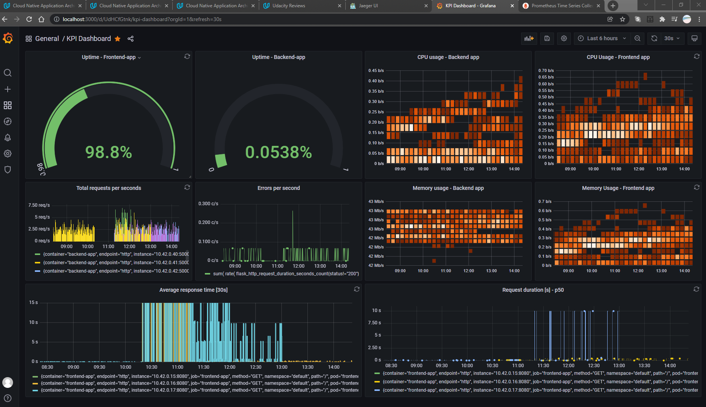

**Note:** For the screenshots, you can store all of your answer images in the `answer-img` directory.
## Verify the monitoring installation
*TODO:* run `kubectl` command to show the running pods and services for all components. Take a screenshot of the output and include it here to verify the installation
### All Pods

### All Services

## Setup the Jaeger and Prometheus source
*TODO:* Expose Grafana to the internet and then setup Prometheus as a data source. Provide a screenshot of the home page after logging into Grafana.

## Create a Basic Dashboard
*TODO:* Create a dashboard in Grafana that shows Prometheus as a source. Take a screenshot and include it here.

## Describe SLO/SLI
*TODO:* Describe, in your own words, what the SLIs are, based on an SLO of *monthly uptime* and *request response time*.
Service Level Indicators (SLIs) are metrics used to measure the performance of services. That is, when we have determined the services that will be provided by our
Service Level Objectives (SLOs), we need to have metrics to determine if our SLOs are up to par. For example, if we have an SLO for the service to have an uptime of 99% in a year,
the SLI will be the 99%. Which means, the service should be up 99% of the time within the year and only a downtime of 3.65 days can be tolerated. 
The SLI for request response time can be measured in seconds and not hours for a request and the response time. Thus, we can measure these metrics and determine if our application
needs upgrades or improvements.

## Creating SLI metrics.
*TODO:* It is important to know why we want to measure certain metrics for our customer. Describe in detail 5 metrics to measure these SLIs. 
Customers are very important, they are the reason an application is developed. Hence, customer satisfactions needs to be considered. Here are 5 metrics we can use to measure customer SLO 
for there satisfaction;
1. Response Time - our application should be able to respond quickly as expected and is reliable
2. Support Center Calls - the metrics to measure this would be 100% availability of support centre
3. Support Forum - the metrics for this would be 100% support of the application via support forum
4. Service Uptime - the metrics for this would be 99% uptime annually.
5. Mentions in Social Media - we should get good feedback from social media mentions, at least 80% positive feedback.

## Create a Dashboard to measure our SLIs
*TODO:* Create a dashboard to measure the uptime of the frontend and backend services We will also want 
to measure to measure 40x and 50x errors. Create a dashboard that show these values over a 24 hour period and take a screenshot.

## Tracing our Flask App
*TODO:*  We will create a Jaeger span to measure the processes on the backend. Once you fill in the span, provide a screenshot of it here.

## Jaeger in Dashboards
*TODO:* Now that the trace is running, let's add the metric to our current Grafana dashboard. Once this is completed, provide a screenshot of it here.

## Report Error
*TODO:* Using the template below, write a trouble ticket for the developers, to explain the errors that you are seeing (400, 500, latency) and to let them know the file that is causing the issue.

TROUBLE TICKET

Name: Jarnen Richard

Date: 21/11/2021

Subject: 400 and 500 Latency

Affected Area: Backend Application Endpoint star

Severity: High

Description: Cannot access the endpoint star from the backend application

## Creating SLIs and SLOs
*TODO:* We want to create an SLO guaranteeing that our application has a 99.95% uptime per month. Name three SLIs that you would use to measure the success of this SLO.
1. Application Uptime in hours per day
2. Average Response Time for successful requests every 30 seconds
3. HTTP Requests Processed per seconds
4. Failed response per second
## Building KPIs for our plan
*TODO*: Now that we have our SLIs and SLOs, create KPIs to accurately measure these metrics. We will make a dashboard for this, but first write them down here.
1. Backend Uptime
2. Frontend Uptime
3. Average response time [30s]
4. Request duration [s] - p50
5. Failed response per second - Errors per second
## Final Dashboard
*TODO*: Create a Dashboard containing graphs that capture all the metrics of your KPIs and adequately representing your SLIs and SLOs. Include a screenshot of the dashboard here, and write a text description of what graphs are represented in the dashboard.  

