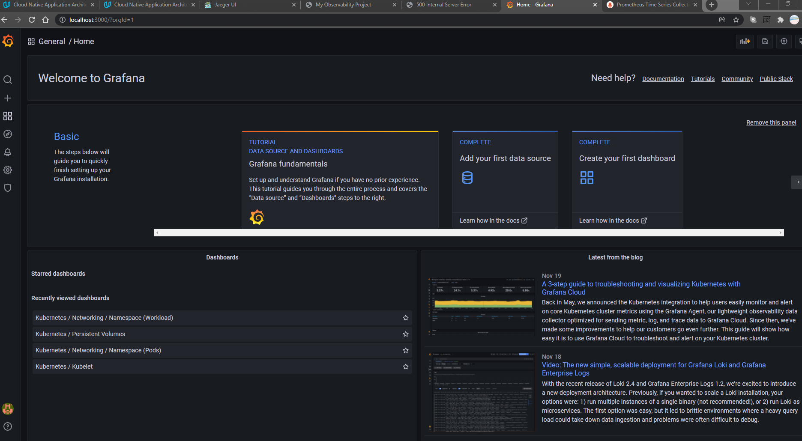

## Project Description
In this project, we created dashboards that use multiple graphs to monitor our sample application that is deployed on a Kubernetes cluster. We used Prometheus, Jaeger, and Grafana in order to monitor, trace and visualize our experience experience.

## Project Objectives
Following sub-sections shows the project objectives and todos that implemented the objectives. Refer [here](https://github.com/udacity/CNAND_nd064_C4_Observability_Starter_Files) for the link to the starter files. 

### Verify the monitoring installation
*TODO:* run `kubectl` command to show the running pods and services for all components. Take a screenshot of the output and include it here to verify the installation
#### All Pods

#### All Services

### Setup the Jaeger and Prometheus source
*TODO:* Expose Grafana to the internet and then setup Prometheus as a data source. Provide a screenshot of the home page after logging into Grafana.

### Create a Basic Dashboard
*TODO:* Create a dashboard in Grafana that shows Prometheus as a source. Take a screenshot and include it here.

### Describe SLO/SLI
*TODO:* Describe, in your own words, what the SLIs are, based on an SLO of *monthly uptime* and *request response time*. 

Service Level Indicators (SLIs) are metrics used to measure the performance of services. That is, when we have determined the services that will be provided by our
Service Level Objectives (SLOs), we need to have metrics to determine if our SLOs are up to par. For example, if we have an SLO for the service to have an uptime of 99% in a year,
the SLI will be the 99%. Which means, the service should be up 99% of the time within the year and only a downtime of 3.65 days can be tolerated. 
The SLI for request response time can be measured in seconds and not hours for a request and the response time. Thus, we can measure these metrics and determine if our application
needs upgrades or improvements.

### Creating SLI metrics.
*TODO:* It is important to know why we want to measure certain metrics for our customer. Describe in detail 5 metrics to measure these SLIs. 
Customers are very important, they are the reason an application is developed. Hence, customer satisfactions needs to be considered. 

Here are 5 metrics we can use to measure customer SLO 
for there satisfaction;
1. Response Time to measure latency- The average response time measured over 30 seconds intervals for successful requests. (Average response time [30s])
2. Requests durations - The 50th percentile of request durations over the last 30 seconds. In other words, half of the requests finish in (min/max/avg) these times.
3. CPU and Memory usage - The memory and cpu data rate usage of the Flask app measured in bits/sec respectively.
4. Errors per second - Number of failed (non HTTP 200) responses per second. These include the 40x and 50x errors and can be measured in counts/second (c/s)
5. Service Uptime - the metrics for this would be 99% uptime monthly measured in time over every 30 days.
6. Total requests per seconds - metrics can be measured in requests/sec (rps) to measure traffic

### Create a Dashboard to measure our SLIs
*TODO:* Create a dashboard to measure the uptime of the frontend and backend services We will also want 
to measure  40x and 50x errors. Create a dashboard that show these values over a 24 hour period and take a screenshot.

### Tracing our Flask App
*TODO:*  We will create a Jaeger span to measure the processes on the backend. Once you fill in the span, provide a screenshot of it here.

### Jaeger in Dashboards
*TODO:* Now that the trace is running, let's add the metric to our current Grafana dashboard. Once this is completed, provide a screenshot of it here.

### Report Error
*TODO:* Using the template below, write a trouble ticket for the developers, to explain the errors that you are seeing (400, 500, latency) and to let them know the file that 
is causing the issue.

TROUBLE TICKET

Name: Jarnen Richard

Date: 21/11/2021

Subject: 500 Latency

Affected Area: Backend Application Endpoint star

Severity: High

Description: Cannot access the endpoint star from the backend application by accessing http://localhost:5000 to access the database stars and post. Refer below is the screenshot of the trace.

### Creating SLIs and SLOs
*TODO:* We want to create an SLO guaranteeing that our application has a 99.95% uptime per month. Name three SLIs that you would use to measure the success of this SLO.
1. Application Uptime in hours per day should be more than 99.9%
2. Average Response Time for successful requests should be less than 30 seconds every month
3. Total failed responses should be less than 0.09% per month. 
### Building KPIs for our plan
*TODO*: Now that we have our SLIs and SLOs, create KPIs to accurately measure these metrics. We will make a dashboard for this, but first write them down here.
1. Application Uptime
- CPU usage will be measured in bits/seconds for frontend and backend service respectively. We want to make sure that the CPU can process all requests. This can help us to scale up or down.
- Memory data rate usage that will be measured in bits per second for each service respectively. This is to monitor usage of memory in order to scale appropriately to serve all requests.
3. Average response time 
- We want to measure the average response time by measuring the average response time measured over 30 seconds intervals for successful requests.
- We measure the request duration in seconds to see how long it took to serve a request. Hence, we will measure the 50th percentile of request durations over the last 30 seconds. In other words, half of the requests finish in (min/max/avg) these times.
5. Failed response per second - Errors per second
- We want to know where the services went wrong. Hence, we will measure the errors counts per second.
- We will also gather total requests in requests per seconds to compare with failed requests.
### Final Dashboard
*TODO*: Create a Dashboard containing graphs that capture all the metrics of your KPIs and adequately representing your SLIs and SLOs. Include a screenshot of the dashboard here, and write a text description of what graphs are represented in the dashboard.  

